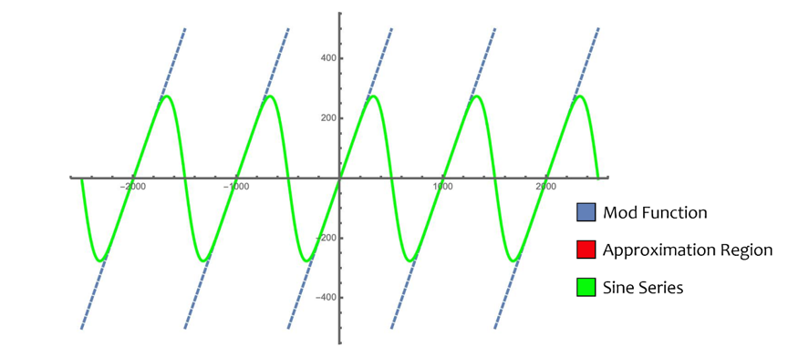
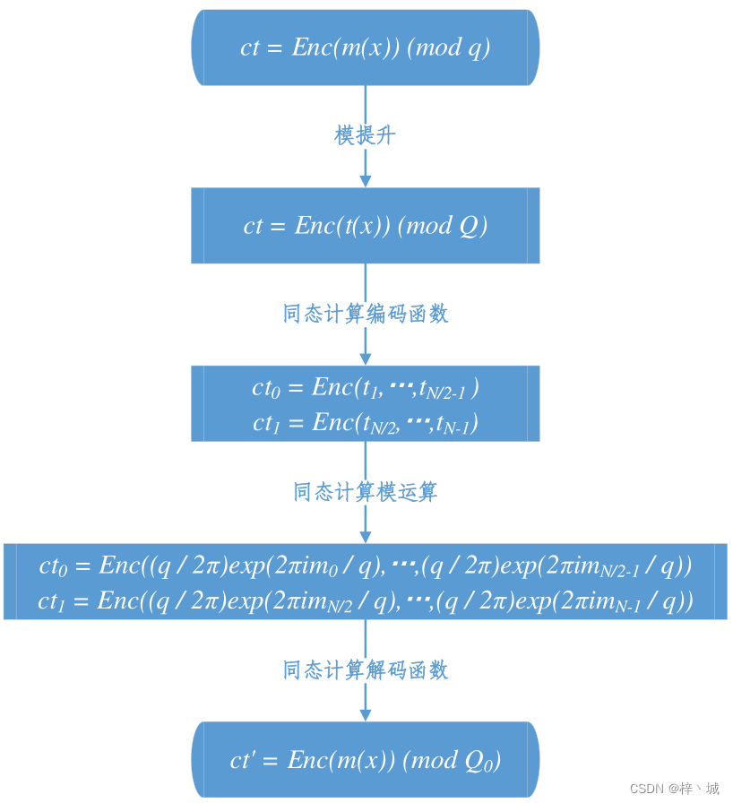

##  Method
<div style="text-align: justify">

Bootstrapping mainly consists of four steps: **ModRaise**, **CoeffToSlot**, **EvalMod**, **SlotToCoeff**
<br>

<center>





</center>

<style>
    img[alt="b1"]{
        width:500px;
    }
    img[alt="b2"]{
        width:500px;
    }
    img[alt="bf"]{
        width:450px;
    }
</style>

<br>

**<font color='red'>Optimization: Chebyshev </font>**

<center>


</center>

<style>
    img[alt="b3"]{
        width:300px;
    }
    img[alt="b4"]{
        width:300px;
    }
    img[alt="b5"]{
        width:600px;
    }
</style>
<br>
</div> 

## Code
```cpp
// Include necessary Poseidon library headers for different functionalities.
#include <iostream>
#include <fstream>   
#include "poseidon/Release/define.h"
#include "poseidon/Release/homomorphic_DFT.h"
#include "poseidon/Release/linear_transform.h"

#include <cstdlib>
#include <vector>
#include <cmath>
#include <complex>
#include "poseidon/Release/util/number_theory.h"
#include "poseidon/Release/hardware/ConfigGen.h"
#include <gmpxx.h>
#include "poseidon/Release/Ciphertext.h"

#include "poseidon/Release/util/matrix_operation.h"
#include "poseidon/Release/CKKSEncoder.h"
#include "poseidon/Release/BatchEncoder.h"
#include "poseidon/Release/random/random_sample.h"


#include "poseidon/Release/KeyGenerator.h"
#include "poseidon/Release/Encryptor.h"
#include "poseidon/Release/Decryptor.h"
#include "poseidon/Release/ParametersLiteral.h"
#include "poseidon/Release/rlwe.h"
#include "poseidon/Release/RelinKeys.h"

#include "poseidon/Release/HardwareEvaluator.h"
#include "poseidon/Release/linear_transform.h"
#include "poseidon/Release/util/matrix_operation.h"
#include "poseidon/Release/homomorphic_mod.h"
#include "poseidon/Release/util/precision.h"
using  namespace  poseidon;

//===================== boostrap ======================================
int main(){
    
    //Define constants for the bootstrap process
    uint32_t q0_bit = 63;
    auto q_def = 31;
    vector<uint32_t> logQTmp{31,31,31,31,31,31,31,31,31,31,  31,31,31,31,31,31,31,31,31,31,  31,31,31,31,31,31,31,31,31,31}; 
    vector<uint32_t> logPTmp{31,31,31,31,31,31,31,31,31,31,  31,31,31,31,31,31,31,31,31,31,  31,31,31,31,31,31,31,31,31,31};
    ParametersLiteral ckks_param_literal(CKKS, 11, 10, logQTmp, logPTmp, q_def, 30,0,1);

    //=====================config======================================
    PoseidonContext context(ckks_param_literal);
    auto q0 = context.crt_context()->q0();
    //=====================init random data ============================
    std::vector<std::complex<double>> vec;
    std::vector<std::complex<double>> vec_result,vec_result1;
    std::vector<vector<std::complex<double>>> mat;
    int mat_size = 1 << ckks_param_literal.LogSlots;
    mat.resize(mat_size);

    //create message
    vector<complex<double>> message;
    vector<complex<double>> message1;
    sample_random_complex_vector(message, mat_size);
    //=====================init  Plain & Ciph =========================
    Plaintext plainA,plainB,plainRes;
    Ciphertext cipherA,cipherB,cipherRes;
    PublicKey public_key;
    RelinKeys relinKeys;
    GaloisKeys rotKeys;
    GaloisKeys conjKeys;
    vector<uint32_t> rot_elemt;
    //

    CKKSEncoder ckks_encoder(context);

    //=====================EvalMod  ========================
    auto level_start = ckks_param_literal.LogQ.size() - 1;

    EvalModPoly evalModPoly(context, CosDiscrete,(uint64_t)1 << (q0_bit - 25) ,level_start-6,8, 3,16,0,30);
    auto scFac = evalModPoly.ScFac();
    double K = evalModPoly.K();
    auto qDiff = evalModPoly.QDiff();
    auto q0OverMessageRatio = exp2(round(log2((double)q0 / (double)evalModPoly.MessageRatio()) ) ) ;
    // If the scale used during the EvalMod step is smaller than Q0, then we cannot increase the scale during
    // the EvalMod step to get a free division by MessageRatio, and we need to do this division (totally or partly)
    // during the CoeffstoSlots step
    auto CoeffsToSlotsScaling = 1.0;
    CoeffsToSlotsScaling *= evalModPoly.qDiv() / (K * scFac * qDiff);
    auto SlotsToCoeffsScaling = (double)context.scaling_factor().get_ui();
    SlotsToCoeffsScaling = SlotsToCoeffsScaling / ((double)evalModPoly.ScalingFactor().get_ui() / (double)evalModPoly.MessageRatio() );

    HomomorphicDFTMatrixLiteral d(0, ckks_param_literal.LogN, ckks_param_literal.LogSlots, level_start, vector<int>(3,1), true, CoeffsToSlotsScaling, false, 1);
    HomomorphicDFTMatrixLiteral x(1, ckks_param_literal.LogN, ckks_param_literal.LogSlots,  8 , vector<int>(3,1), true, SlotsToCoeffsScaling, false, 1);
    LinearMatrixGroup mat_group;
    LinearMatrixGroup mat_group_dec;
    d.create(mat_group,ckks_encoder,2);
    x.create(mat_group_dec,ckks_encoder,1);


    //=====================keys  =========================
    KeyGenerator kgen(context);
    kgen.create_public_key(public_key);
    kgen.create_relin_keys(relinKeys);
    kgen.create_galois_keys(mat_group.rot_index(),rotKeys);
    kgen.create_conj_keys(conjKeys);

    Encryptor enc(context,public_key,kgen.secret_key());
    Decryptor dec(context,kgen.secret_key());

    //===================== Doing ==============================
    //encode
    ckks_encoder.encode(message,plainA,(int64_t) 1 << q_def );
    //encrypt
    enc.encrypt(plainA,cipherA);


    auto ckks_eva = EvaluatorFactory::DefaultFactory()->create(context);


    auto start = chrono::high_resolution_clock::now();
    ckks_eva->bootstrap(cipherA,cipherRes,evalModPoly,mat_group,mat_group_dec,relinKeys,rotKeys,conjKeys,ckks_encoder);
    auto stop = chrono::high_resolution_clock::now();
    auto duration = chrono::duration_cast<chrono::microseconds>(stop - start);
    cout << "EXP TIME: " << duration.count() << " microseconds"<< endl;
    ckks_eva->read(cipherRes);
    dec.decrypt(cipherRes,plainRes);
    ckks_encoder.decode(plainRes,vec_result);

    
    for(int i = 0; i < 10; i++){

        printf("source vec[%d] : %0.10f + %0.10f I \n",i,(real(message[i])), imag(message[i]));
        printf("result vec[%d] : %0.10f + %0.10f I \n",i,(real(vec_result[i])), imag(vec_result[i]));
    }
    GetPrecisionStats(vec_result,message);


    return 0;
}
```