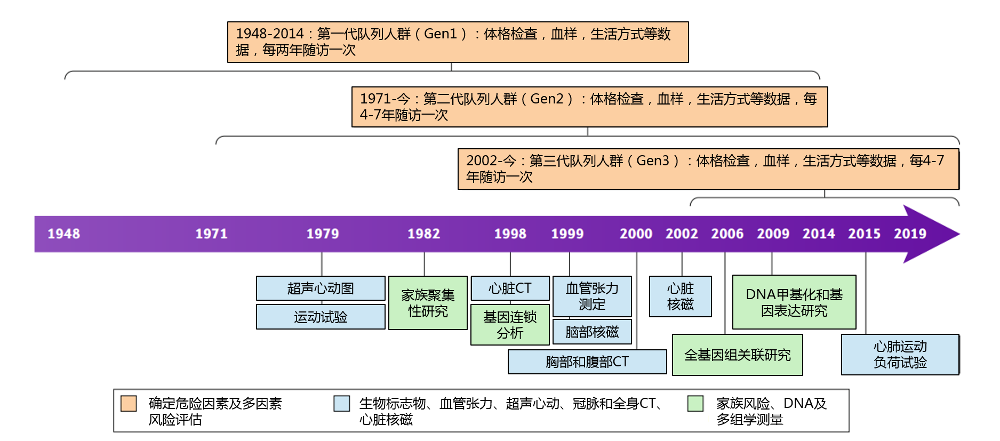
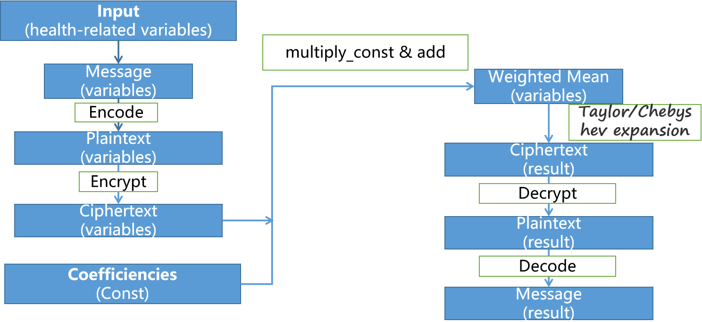

## Introduction

<div style="text-align: justify">
Framingham Heart Study (FHS) is the longest duration cardiovascular epidemiological study funded by the National Institutes of Health in 1948, aimed at improving understanding of the epidemiology of coronary heart disease in the United States. FHS indicates that cardiovascular disease is closely related to various factors such as age, blood pressure, cholesterol, height, weight, etc. Therefore, these health-related parameters can be used to predict the probability of cardiovascular disease.
<br>
<br>
<br>


<style>
    img[alt="f1"]{
        width:800px;
    }
</style>

<br>
<br>

**Prediction process**

1. Users input their own sign parameters and encrypt them

2. The processor performs encrypted calculations on the encrypted data<br>
**x** = 0.072∙Age+0.013∙SBP-0.029∙DBP+0.008∙CHL-0.053∙height+0.021∙weight<br>

3. Users decrypt the calculation results to obtain a prediction of their probability of developing cardiovascular diseases<br>**Prediction**：e^x/(1+e^x)<br>

</div>
<br>
<br>

## Application Flowchart
<br>
<br>


<style>
    img[alt="ff"]{
        width:800px;
    }
</style>

<br>
<br>

## Code
```cpp
// Include necessary Poseidon library headers for different functionalities.

#include <iostream>
#include <fstream>   
#include <cstdlib>
#include <vector>
#include <cmath>
#include <complex>
#include <math.h>
#include <gmpxx.h>

#include "poseidon/Release/define.h"
#include "poseidon/Release/homomorphic_DFT.h"
#include "poseidon/Release/linear_transform.h"
#include "poseidon/Release/util/number_theory.h"
#include "poseidon/Release/hardware/ConfigGen.h"

#include "poseidon/Release/Ciphertext.h"

#include "poseidon/Release/util/matrix_operation.h"
#include "poseidon/Release/CKKSEncoder.h"
#include "poseidon/Release/BatchEncoder.h"
#include "poseidon/Release/random/random_sample.h"

#include "poseidon/Release/random/RandomGen.h"
#include "poseidon/Release/random/Blake2xbPRNG.h"
#include "poseidon/Release/KeyGenerator.h"
#include "poseidon/Release/Encryptor.h"
#include "poseidon/Release/Decryptor.h"
#include "poseidon/Release/ParametersLiteral.h"
#include "poseidon/Release/rlwe.h"
#include "poseidon/Release/RelinKeys.h"

#include "poseidon/Release/Evaluator.h"
#include "poseidon/Release/HardwareEvaluator.h"
#include "poseidon/Release/linear_transform.h"
#include "poseidon/Release/util/matrix_operation.h"
#include "poseidon/Release/homomorphic_mod.h"
#include "poseidon/Release/util/chebyshev_interpolation.h"


//===================== Chebyshev  ============================
using namespace std;
using namespace poseidon;

double this_fun(double x)  {
    return  exp(x) / (exp(x) + 1);
    //return sin(6.283185307179586 * x) ;
}

int main()
{

    CKKSParametersLiteralDefault ckks_param_literal(degree_2048);
    PoseidonContext context(ckks_param_literal);

    //=====================init data ============================
    int vec_size = 1 << ckks_param_literal.LogSlots;
    double age, sbp, dbp, chl, height, weight;
    age = 26;
    sbp = 100;
    dbp = 70;
    chl = 100;
    height = 71;
    weight = 180;
    //输入个人身体参数，例：26, 100, 70, 100, 72, 180
    // printf("Please input your age:");
    // scanf("%lf", &age);
    // printf("\nPlease input your SBP:");
    // scanf("%lf", &sbp);
    // printf("\nPlease input your DBP:");
    // scanf("%lf", &dbp);
    // printf("\nPlease input your CHL:");
    // scanf("%lf", &chl);
    // printf("\nPlease input your height:");
    // scanf("%lf", &height);
    // printf("\nPlease input your weight:");
    // scanf("%lf", &weight);
    // printf("\n");

    //create message
    vector<complex<double>> message_age, message_sbp, message_dbp, message_chl, message_height, message_weight, vec_result;
    message_age.resize(vec_size);
    message_sbp.resize(vec_size);
    message_dbp.resize(vec_size);
    message_chl.resize(vec_size);
    message_height.resize(vec_size);
    message_weight.resize(vec_size);

    //The address with a message index of 0 stores the original value of the corresponding body data
    message_age[0] = age;
    message_sbp[0] = sbp;
    message_dbp[0] = dbp;
    message_chl[0] = chl;
    message_height[0] = height;
    message_weight[0] = weight;

    //Coef storage corresponding coefficient
    double coef_age = 0.072;
    double coef_sbp = 0.013;
    double coef_dbp = -0.029;
    double coef_chl = 0.008;
    double coef_height = -0.053;
    double coef_weight = 0.021;

    //The coefficients of Taylor expansion
    double taylor_coef_0 = 1.0 / 2;
    double taylor_coef_1 = 1.0 / 4;
    double taylor_coef_3 = -1.0 / 48;
    double taylor_coef_5 = 1.0 / 480;
    double taylor_coef_7 = -17.0 / 80640;
    double taylor_coef_9 = 31 / 1451520;

    //=====================init  Plain & Ciph =========================
    Plaintext plain_age, plain_sbp, plain_dbp, plain_chl, plain_height, plain_weight, plain_result;
    Ciphertext cipher_age, cipher_sbp, cipher_dbp, cipher_chl, cipher_height, cipher_weight, cipher_x, cipher_x_square, cipher_result;
    PublicKey public_key;
    RelinKeys relinKeys;
    // GaloisKeys rotKeys;
    GaloisKeys conjKeys;
    // vector<uint32_t> rot_elemt;
    CKKSEncoder ckks_encoder(context);
//=====================poly init===================================
    auto a = -8.0;
    auto b = 8.0;
    auto deg = 64;
    printf("Evaluation of the function f(x) for even slots and g(x) for odd slots in the range [%0.2f, %0.2f] (degree of approximation: %d)\n", a, b, deg);

    auto approxF = util::Approximate(this_fun, a, b, deg);
    approxF.lead() = true;
    //auto approxG = util::Approximate(g, a, b, deg);
    vector <Polynomial> poly_v{approxF};
    vector<vector<int>> slotsIndex(1,vector<int>(context.poly_degree() >> 1,0));
    vector<int> idxF(context.poly_degree() >> 1);

    for(int i = 0; i < context.poly_degree() >> 1; i++){
        idxF[i] = i;   // Index with all even slots
    }
    slotsIndex[0] = idxF; // Assigns index of all even slots to poly[0] = f(x)

    PolynomialVector polys(poly_v,slotsIndex);

    //=====================keys  =========================
    KeyGenerator kgen(context);
    kgen.create_public_key(public_key);
    kgen.create_relin_keys(relinKeys);
    kgen.create_conj_keys(conjKeys);
    Encryptor enc(context,public_key,kgen.secret_key());
    Decryptor dec(context,kgen.secret_key());

    //-------------------encode--------------------------------
    ckks_encoder.encode(message_age, plain_age, context.scaling_factor());
    ckks_encoder.encode(message_sbp, plain_sbp, context.scaling_factor());
    ckks_encoder.encode(message_dbp, plain_dbp, context.scaling_factor());
    ckks_encoder.encode(message_chl, plain_chl, context.scaling_factor());
    ckks_encoder.encode(message_height, plain_height, context.scaling_factor());
    ckks_encoder.encode(message_weight, plain_weight, context.scaling_factor());

    //-------------------encrypt--------------------------------
    enc.encrypt(plain_age,cipher_age);
    enc.encrypt(plain_sbp,cipher_sbp);
    enc.encrypt(plain_dbp,cipher_dbp);
    enc.encrypt(plain_chl,cipher_chl);
    enc.encrypt(plain_height,cipher_height);
    enc.encrypt(plain_weight,cipher_weight);

    //-------------------------calculate----------------------------------
    //Create CKKS Evaluator
    auto ckks_eva = EvaluatorFactory::DefaultFactory()->create(context);

    auto start = chrono::high_resolution_clock::now();

    //Compute x = 0.072∙Age+0.013∙SBP-0.029∙DBP+0.008∙CHL-0.053∙height+0.021∙weight

    ckks_eva->multiply_const(cipher_age, coef_age, cipher_age);
    ckks_eva->multiply_const(cipher_sbp, coef_sbp, cipher_sbp);
    ckks_eva->multiply_const(cipher_dbp, coef_dbp, cipher_dbp);
    ckks_eva->multiply_const(cipher_chl, coef_chl, cipher_chl);
    ckks_eva->multiply_const(cipher_height, coef_height, cipher_height);
    ckks_eva->multiply_const(cipher_weight, coef_weight, cipher_weight);

    ckks_eva->add(cipher_age, cipher_sbp, cipher_x);
    ckks_eva->add(cipher_x, cipher_dbp, cipher_x);
    ckks_eva->add(cipher_x, cipher_chl, cipher_x);
    ckks_eva->add(cipher_x, cipher_height, cipher_x);
    ckks_eva->add(cipher_x, cipher_weight, cipher_x);
    ckks_eva->rescale(cipher_x);

    //Compute e^x/(e^x+1)
    ckks_eva->multiply_const(cipher_x,(2.0/(double)(b-a)),cipher_x);
    ckks_eva->rescale(cipher_x);
    ckks_eva->evaluatePolyVector(cipher_x,cipher_result,polys,cipher_x.metaData()->getScalingFactor(),relinKeys,ckks_encoder);
    ckks_eva->read(cipher_result);
    auto stop = chrono::high_resolution_clock::now();
    auto duration = chrono::duration_cast<chrono::microseconds>(stop - start);
    cout << "EXP TIME: " << duration.count() << " microseconds"<< endl;

    //---------------------decode & decrypt-------------------------------
    dec.decrypt(cipher_result, plain_result);
    ckks_encoder.decode(plain_result, vec_result);

    printf("answer after FHE = %.8f \n",real(vec_result[0]));

    //expected answer
    double x = coef_age * age + coef_sbp * sbp + coef_dbp * dbp + coef_chl * chl + coef_height * height + coef_weight * weight;

    printf("expected answer = %.8f \n",exp(x) / (exp(x) + 1));

    return 0;
}

```